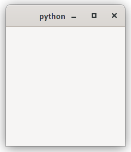
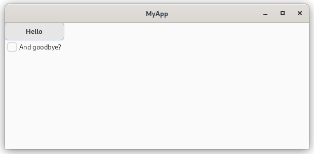
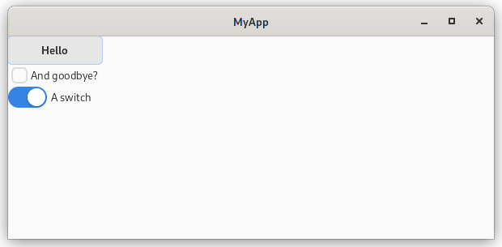

# Taiko's GTK4 Python tutorial

Wanna make apps for Linux but not sure how to start with GTK? Frustrated with the style of GTK4 documentation. This guide will hopefully get you started!

Prerequisite: You have learnt the basics of Python

## A most basic program

```python
import gi
gi.require_version('Gtk', '4.0')
from gi.repository import Gtk

def on_activate(app):
    win = Gtk.ApplicationWindow(application=app)
    win.present()

app = Gtk.Application(application_id='com.example.GtkApplication')
app.connect('activate', on_activate)

app.run(None)

```

This should display a small blank window.



Oh btw, you'll want to think of an application id for your app, especially if you're going to distribute it. It should be the reverse of a domain or page you control. If you dont have your own domain you can do like "com.github.me.myproject".

Right um... lets make that code into classes! Cause doing it functional style is a little awkward in Python.

Also, **Libawaita** is the new hotness, so lets switch to that!

Aaand we'll pass the app arguments in.

Here's what we got now:

## A better structured basic GTK4 + Adwaita


```python
import sys
import gi
gi.require_version('Gtk', '4.0')
gi.require_version('Adw', '1')
from gi.repository import Gtk, Adw


class MainWindow(Gtk.ApplicationWindow):
    def __init__(self, *args, **kwargs):
        super().__init__(*args, **kwargs)
	# Things will go here

class MyApp(Adw.Application):
    def __init__(self, **kwargs):
        super().__init__(**kwargs)
        self.connect('activate', self.on_activate)

    def on_activate(self, app):
        self.win = MainWindow(application=app)
        self.win.present()

app = MyApp(application_id="com.example.GtkApplication")
app.run(sys.argv)

```

Soo we have an instance of an app class and a window which we extend! We run our app and it makes a window!

> **Tip:** Don't worry too much if your Python knowledge isn't strong and the `__init__(self, *args, **kwargs)` stuff is giving you a headache.

### So! Whats next?

Well, we want to add something to our window. That would likely be a layout of some sort!

Most basic layout is a [Box](https://docs.gtk.org/gtk4/class.Box.html).

Lets add a box to the window! (Where the comment "*things will go here*" is above)

```python
self.box = Gtk.Box()
self.set_child(self.box)
```

We make a new box, and attach it to the window. Simple. If you run the app now you'll see no difference, because there's nothing in the layout yet either.


## Add a button!

One of the most basic widgets is a [Button](https://docs.gtk.org/gtk4/class.Button.html). Let's make one and add it to the layout.

```python
self.button = Gtk.Button(label="Hello")
self.box1.append(self.button)
```

Now our app has a button! (The window will be small now)

But it does nothing when we click it. Let's connect it to a function! Make a new method that prints hello world, and we connect it! 

Here's our MainWindow so far:

```python
class MainWindow(Gtk.ApplicationWindow):
    def __init__(self, *args, **kwargs):
        super().__init__(*args, **kwargs)
        self.box1 = Gtk.Box(orientation=Gtk.Orientation.VERTICAL)
        self.set_child(self.box1)

        self.button = Gtk.Button(label="Hello")
        self.box1.append(self.button)
        self.button.connect('clicked', self.hello)

    def hello(self, button):
        print("Hello world")
```

Cool eh?

By the way the ***Box*** layout lays out widgets in like a vertical or horizontal order. We should set the orientation of the box. See the change:

```python
self.box1 = Gtk.Box(orientation=Gtk.Orientation.VERTICAL)
```

### Quick intermission, lets set some fun stuff

```python
self.set_default_size(600, 250)
self.set_title("MyApp")
```

## More boxes

You'll notice our button is stretched with the window. Let's add two boxes inside that first box we made. 

```python
self.box1 = Gtk.Box(orientation=Gtk.Orientation.HORIZONTAL)
self.box2 = Gtk.Box(orientation=Gtk.Orientation.VERTICAL)
self.box3 = Gtk.Box(orientation=Gtk.Orientation.VERTICAL)

self.button = Gtk.Button(label="Hello")
self.button.connect('clicked', self.hello)

self.set_child(self.box1)  # Horizontal box to window
self.box1.append(self.box2)  # Put vert box in that box
self.box1.append(self.box3)  # And another one, empty for now

self.box2.append(self.button) # But button in the first of the two vertial boxes
```

Now that's more neat!

## Add a check button!

So, we know about a button, next lets add a [Checkbutton](https://docs.gtk.org/gtk4/class.CheckButton.html).

```python
    ...
    self.check = Gtk.CheckButton(label="And goodbye?")
    self.box2.append(self.check)


def hello(self, button):
    print("Hello world")
    if self.check.get_active():
        print("Goodbye world!")
        self.close()
```



When we click the button, we can check the state of the checkbox!

## Add a switch

For our switch, we'll want to put our switch in a ***Box***, otherwise it'll look all stretched.

```python
        ...
        self.switch_box = Gtk.Box(orientation=Gtk.Orientation.HORIZONTAL)

        self.switch = Gtk.Switch()
        self.switch.set_active(True)  # Let's default it to on
        self.switch.connect("state-set", self.switch_switched) # Lets trigger a function

        self.switch_box.append(self.switch)
        self.box2.append(self.switch_box)

    def switch_switched(self, switch, state):
        print(f"The switch has been switched {'on' if state else 'off'}")
```

Try it out!

Our switch is looking rather nondescript, so lets add a label to it!
 

## Add a Label

A label is like a basic line of text

```python
self.label = Gtk.Label(label="A switch")
self.switch_box.append(self.switch)
self.switch_box.set_spacing(5) # Add some spacing

```

It should look like this now:



The file `part1.py` is an example of the code so far.

## Adding a slider (Aka scale)

Here's an example of adding a [Scale](https://docs.gtk.org/gtk4/ctor.Scale.new.html) with a range from 0 - 10

```python
        self.slider = Gtk.Scale()
        self.slider.set_digits(0)  # Number of decimal places to use
        self.slider.set_range(0, 10)
        self.slider.set_draw_value(True)  # Show a label with current value
        self.slider.set_value(5)  # Sets the current value/position
        self.slider.connect('value-changed', self.slider_changed)
        self.box2.append(self.slider)

    def slider_changed(self, slider):
        print(int(slider.get_value()))
```

## Adding a button into the header bar

First we need to make a header bar

```python
        self.header = Gtk.HeaderBar()
        self.set_titlebar(self.header)
```

Simple.

Now add a button

```python
        self.open_button = Gtk.Button(label="Open")
        self.header.pack_start(self.open_button)
```

We already know how to connect a function to the button, so i've omitted that.

Done! But... it would look nicer with an icon rather than text.

```python
        self.open_button.set_icon_name("document-open-symbolic")
```

This will be an icon name from the icon theme. 

For some defaults you can take a look at `/usr/share/icons/Adwaita/scalable/actions`.

If you were adding a new action icon it would go in `/usr/share/icons/hicolor/scalable/actions`

> **Help! Todo!** Is this the best way? How do icons work in a development environment?

# Adding a button with menu

First, lets add a ***MenuButton*** to our header bar

```python
        self.hamburger = Gtk.MenuButton()
        self.header.pack_start(self.hamburger)
```

WIP

## Todo...


Text box: [Entry](https://docs.gtk.org/gtk4/class.Entry.html) 

Number changer: [SpinButton](https://docs.gtk.org/gtk4/class.SpinButton.html)


